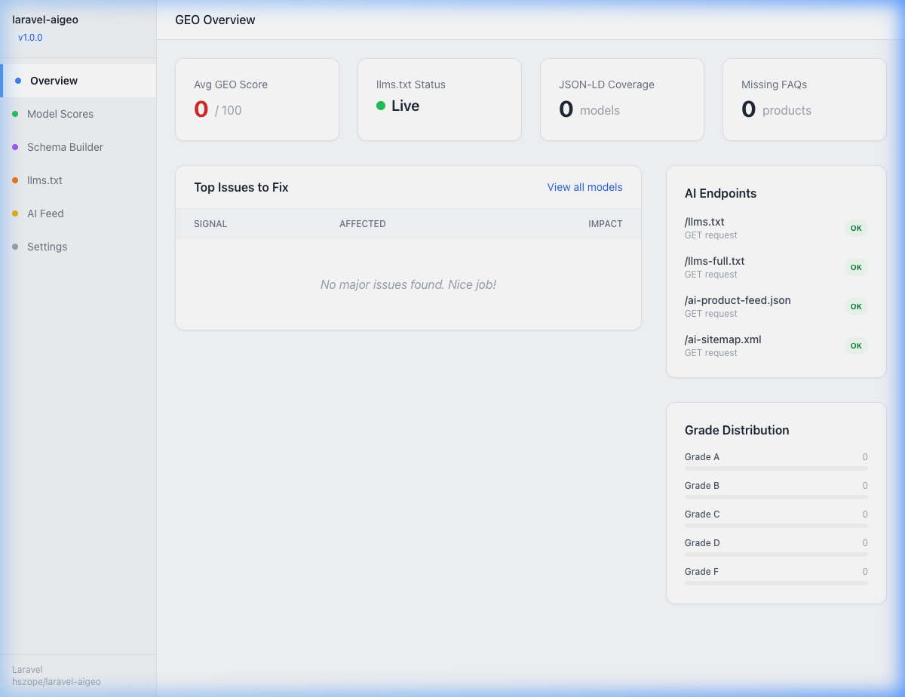
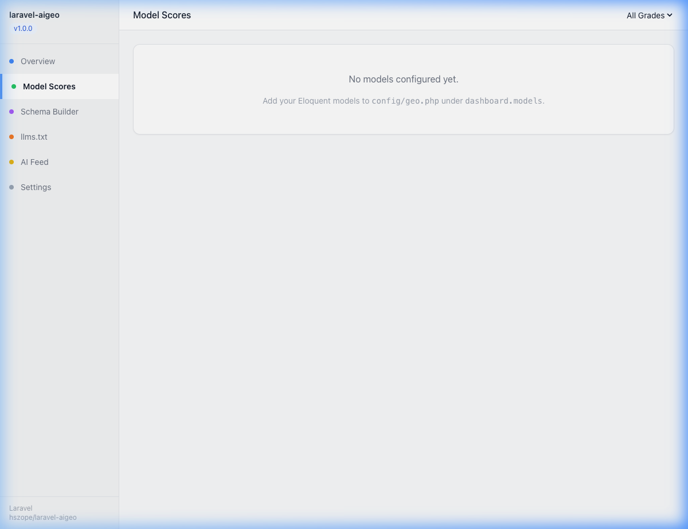
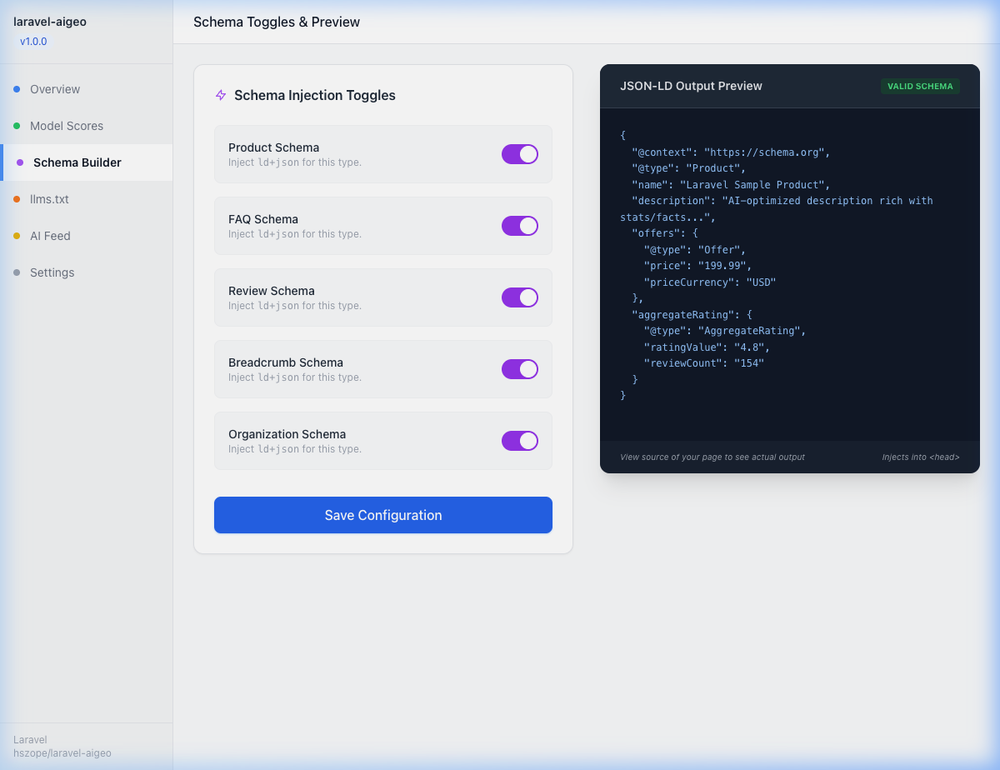
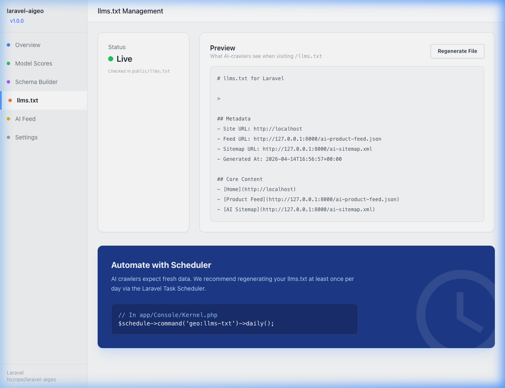
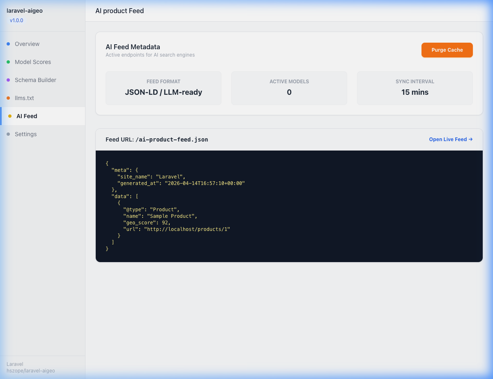
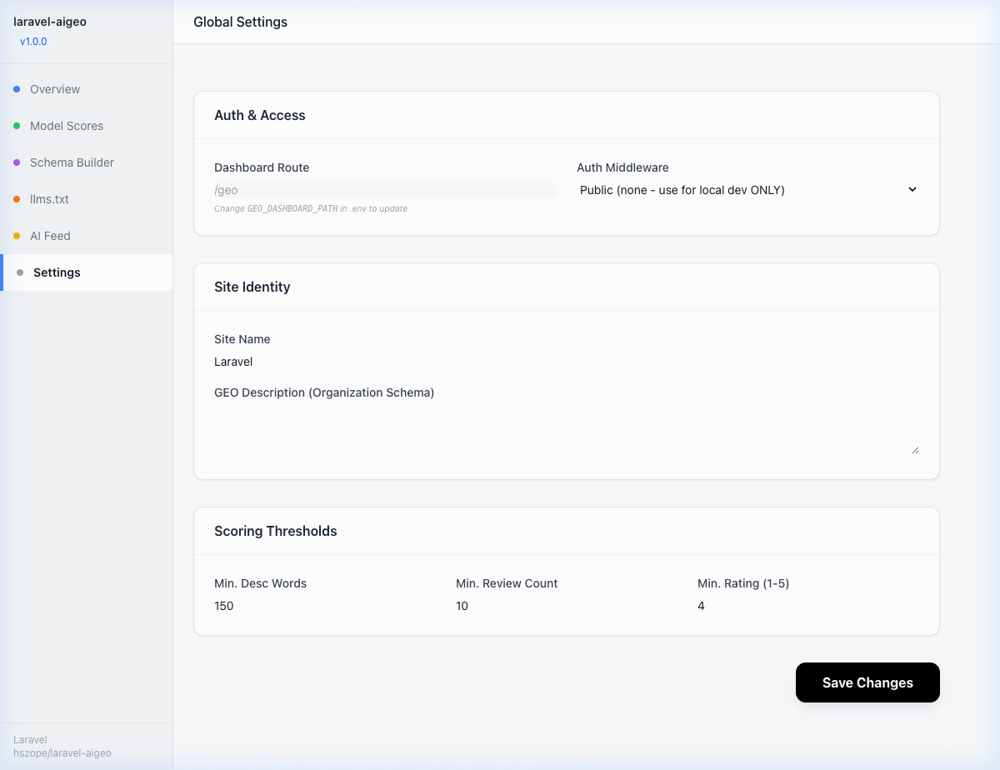

# laravel-aigeo

> Generative Engine Optimization (GEO) for Laravel. Get your products surfaced
> inside AI-generated answers from ChatGPT, Gemini, Perplexity, Claude, and Bing AI.

## Why GEO matters in 2026

Search is shifting from a list of blue links to direct, generated answers. AI answer engines (ChatGPT, Google Overviews, Perplexity) are becoming the primary discovery tool for users. If your content isn't optimized for these engines, you don't exist in the AI-first world.

## Features

1.  **llms.txt Generation**: Automatically creates and serves `llms.txt` to guide AI crawlers.
2.  **Rich JSON-LD Schema**: Injects semantic metadata into your pages to help LLMs understand your products perfectly.
3.  **GEO Scoring**: Audit your products with a 0-100 score based on AI-critical signals.
4.  **Citation Enrichment**: Automatically adds stat-rich, citation-worthy data.
5.  **AI Product Feed**: Serves a specialized JSON feed designed specifically for LLM indexing.
6.  **Visual Dashboard**: A beautiful, premium interface to manage and audit your GEO performance.
7.  **Blade Components**: Simple tools to integrate GEO features into your existing views.

## Dashboard Preview



<p align="center">
  
  
</p>
<p align="center">
  
  
</p>
<p align="center">
  
</p>

## Requirements

- PHP 8.2+
- Laravel 10, 11, or 12

## Installation

```bash
composer require hszope/laravel-aigeo
```

Publish the config, migrations, and assets:

```bash
php artisan vendor:publish --tag="laravel-aigeo-config"
php artisan vendor:publish --tag="laravel-aigeo-migrations"
php artisan migrate
```

## Quick Start 

### 1. Add the Trait

Add the `HasGeoProfile` trait to any Model you want surfaced to AI (e.g. `Product`, `Article`, `User`).

```php
use Hszope\LaravelAigeo\Traits\HasGeoProfile;

class Product extends Model
{
    use HasGeoProfile;

    // Map your database fields to the AI schema
    public function geoProfile(): array
    {
        return [
            'name'         => $this->name,
            'description'  => $this->description,
            'price'        => $this->price,
            'sku'          => $this->sku,
            'image'        => $this->image_url,
            'url'          => url("/products/{$this->id}"),
            'rating'       => $this->average_rating ?? null,
            'review_count' => $this->review_count ?? null,
            'currency'     => 'USD',
            'in_stock'     => true,
            'attributes'   => [
                'Brand' => $this->brand->name,
            ],
        ];
    }
}
```

### 2. Inject the AI Schema

Add the `<x-geo-head>` component to your layout's `<head>`. This will automatically inject highly optimized JSON-LD scripts on your product pages.

```html
<head>
    <x-geo-head :model="$product" />
</head>
```

### 3. Setup Scheduled AI Feeds

To keep your `llms.txt` and `ai-product-feed.json` updated automatically for AI crawlers, add the following commands to your Laravel schedule (usually in `routes/console.php` or `app/Console/Kernel.php`):

```php
use Illuminate\Support\Facades\Schedule;

Schedule::command('geo:llms-txt')->daily();
Schedule::command('geo:feed')->daily();
```

## Securing the Dashboard

The package comes with a built-in dashboard accessible at `/geo`. 
**By default, you should protect this route using Laravel middleware.** 

Open `config/geo.php` and configure your middleware and models:

```php
'dashboard' => [
    'enabled'    => true,
    'path'       => '/geo',
    'middleware' => ['web', 'auth'], // Add 'auth' or your custom admin middleware here
    
    // Which models should show up in your Audit page?
    'models' => [
        ['model' => \App\Models\Product::class, 'label' => 'Products'],
        ['model' => \App\Models\Article::class, 'label' => 'Articles'],
    ],
],
```

## Testing

```bash
composer test
```

## License

The MIT License (MIT). Please see [License File](LICENSE) for more information.
